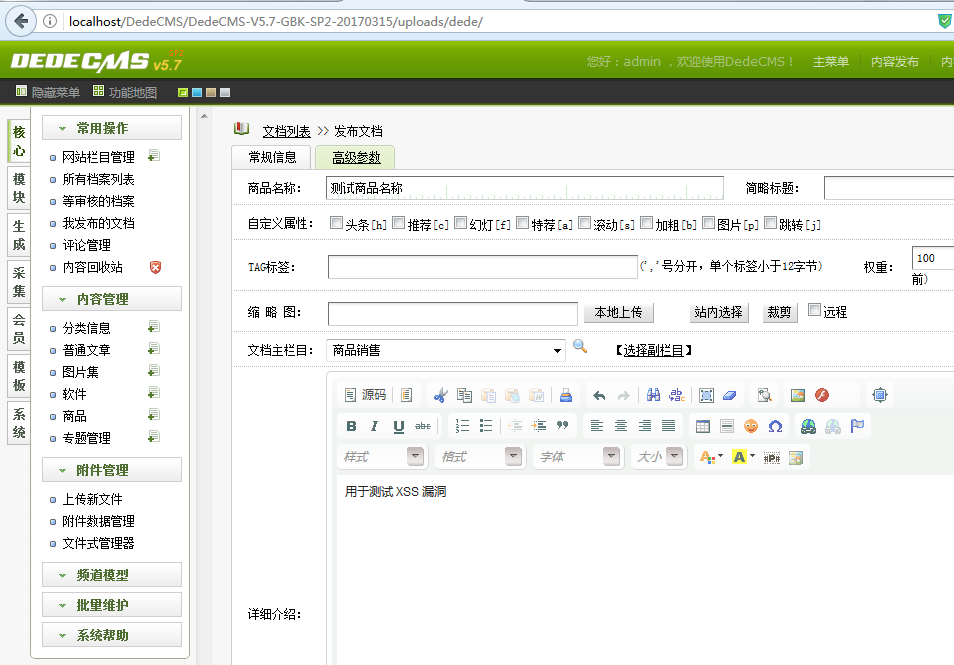
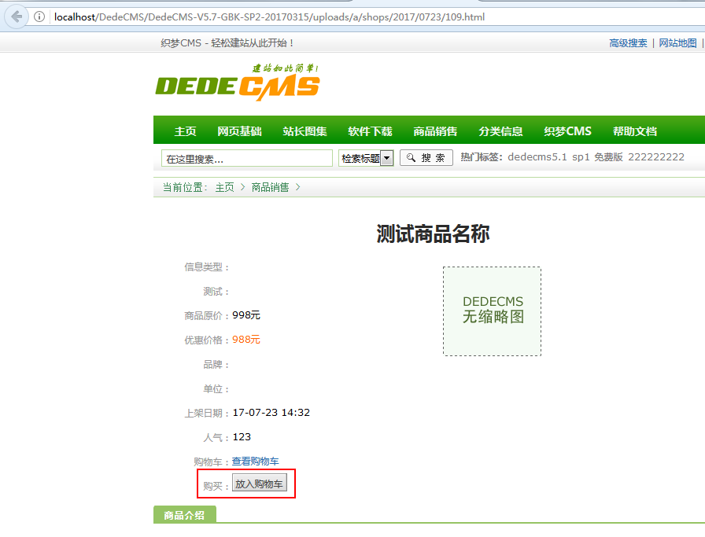
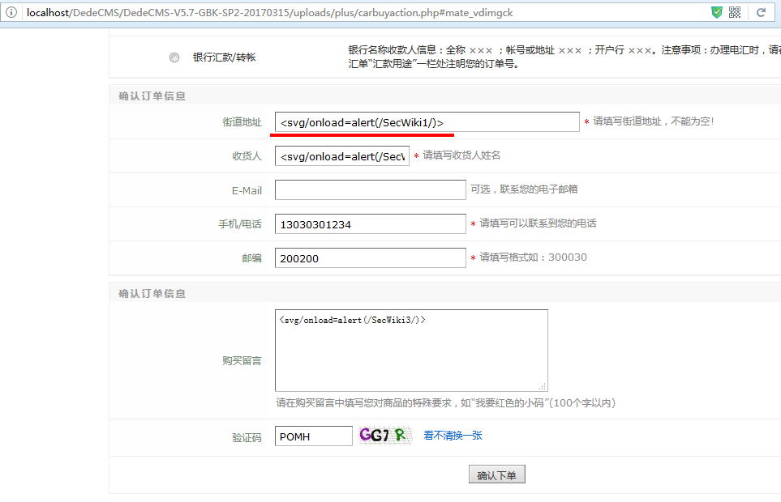
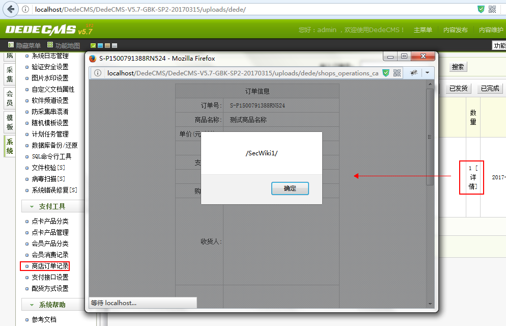

# DedeCMS_v5.7_carbuyaction_存储型XSS

## Affected Version

DedeCMS-V5.7-UTF8-SP2  （ 发布日期  2017-03-15 ）

需要站点启用商城功能。

下载地址： 链接: https://pan.baidu.com/s/1bprjPx1 密码: mwdq

## PoC

该漏洞 通过用户在编写订单收货地址的相关参数 注入 XSS Payload，导致 前台查看订单的页面和后台管理员查看订单详情的页面都会被 XSS。

所以说，可以用来打管理员 Cookie 。

测试：

1. 首先管理员添加一项商城的商品

2. 前台用户选定商品添加购物车

3. 前台用户编辑订单的收货地址，在这里 address,des,email,postname 都是存在 XSS 的，插入 XSS Payload

4. 查看订单详情发现前台已经被 XSS

5. 管理员进入后台查看商城订单同样也会被 XSS  :p

## References

1. https://www.seebug.org/vuldb/ssvid-92855
