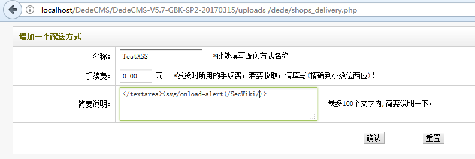
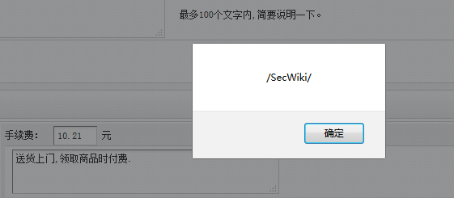
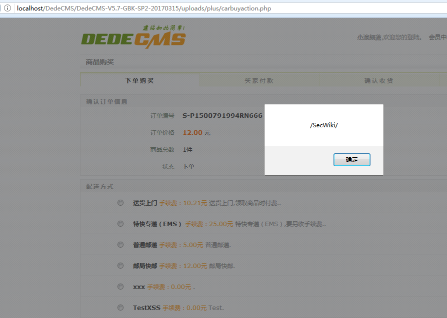

# DedeCMS_v5.7_shops_delivery_存储型XSS

## Affected Version

DedeCMS-V5.7-UTF8-SP2  （ 发布日期  2017-03-15 ）

需要站点启用商城功能。

下载地址： 链接: https://pan.baidu.com/s/1bprjPx1 密码: mwdq

## PoC

该漏洞比较鸡肋，需要登录 管理员后台通过 添加配送方式 功能 ，添加后在前后台都会触发 存储型 XSS

之所以会触发是因为在系统对 管理员输入的 配送方式-描述字段（des）在入库前只进行 addslashes 转义特殊字符处理，其实这没毛病

重要的是取出数据库的数据输出到页面前没进行 HTML 实体编码处理直接输出导致最终的 XSS

测试：

1. 后台添加 配送方式

2. 添加成功后直接展示配送方式列表，触发 XSS

3. 此外，这个 XSS 在前台用户购买东西选择配送方式的时候也会触发

## References

1. https://www.seebug.org/vuldb/ssvid-92863
