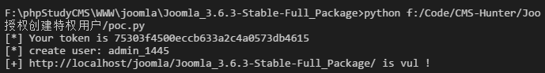
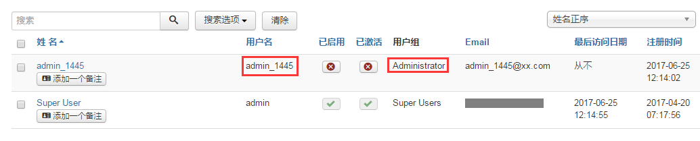

# Joomla_3.4.4-3.6.3_未授权创建特权用户(CVE-2016-8869)

## Affected Version

Joomla! 3.4.4 - 3.6.3

## PoC

注意： 由于默认关闭注册功能，所以导致创建的管理员用户未激活无法使用。

测试：

登录后台确认用户中增加了 Administrator 的一个用户：

## References

1. http://blog.knownsec.com/2016/10/joomla-register-cve-2016-8869/

2. https://github.com/sunsunza2009/Joomla-3.4.4-3.6.4_CVE-2016-8869_and_CVE-2016-8870