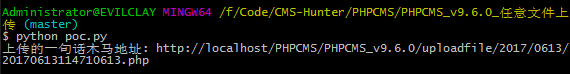
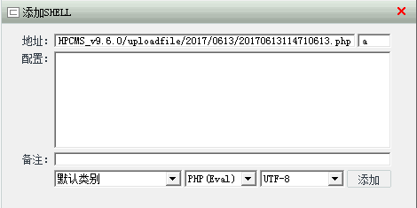
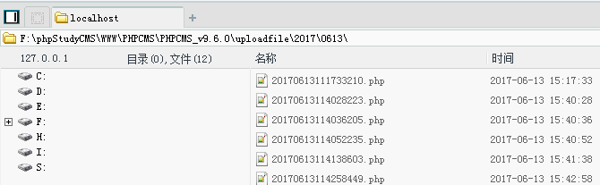

# PHPCMS_v9.6.0_任意文件上传

## Official

http://bbs.phpcms.cn/thread-936226-1-1.html

## Affected Version

PHPCMS v9.6.0

## PoC

注意： 每次测试后都需要把 poc.py 中 post data 的 username 和 email 修改一遍。

使用菜刀连接：

## References

1. http://www.evilclay.com/2017/05/10/PHPCMSv9-6-0任意文件上传漏洞分析/
